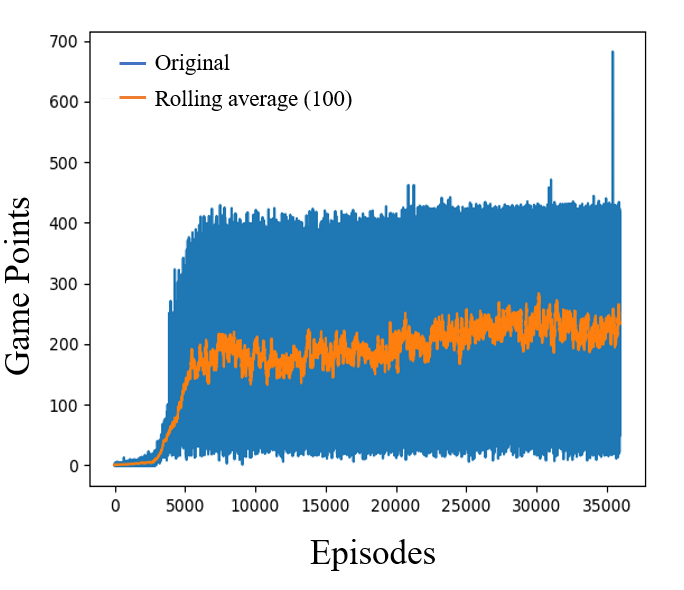
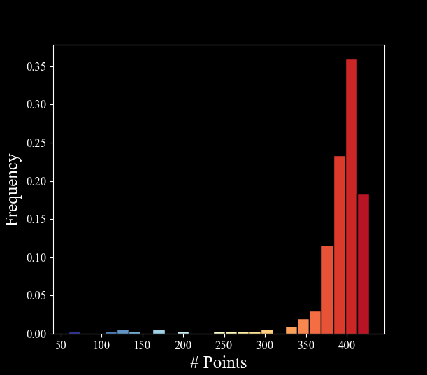
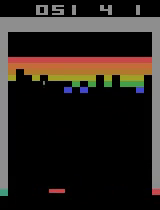

# Double-DQN

Required libraries:
1) gym 
2) numpy 
3) Tensorflow 

## For running the DDQN:
Just run the Ddqn_tf2_6.py file and follow the instruction!

# Trining plot
<!---
your comment goes here 
and here 

-->
Based on epsilon greedy with epsilon decreases linearly from 1 ---> 0.1 during the first 1 million frames and then stays constant as 0.1.

# Results
Based on epsilon greedy with epsilon = 0.01 and 300 games

## Watch on youtube: https://youtu.be/rqz6ZhlWY1s
